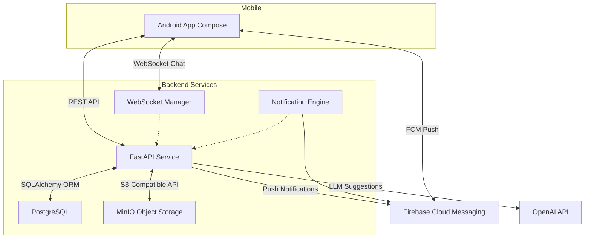
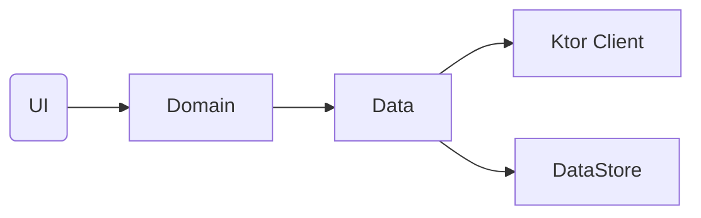
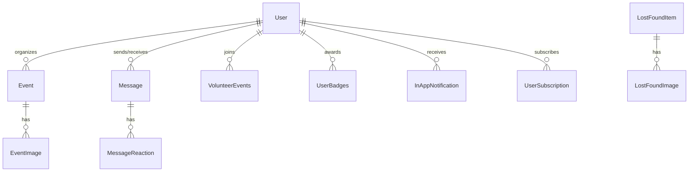

# GoodDeedFeed – Architecture Guide

---

## 1. Overview
GoodDeedFeed is a **volunteering & community engagement platform** consisting of:

1. **Android mobile app** – Built with Jetpack Compose, MVVM & Hilt.
2. **Backend API** – Python FastAPI service exposing REST + WebSocket endpoints.
3. **Data layer** – PostgreSQL for relational data, MinIO (S3-compatible) for object storage, Firebase Cloud Messaging for push notifications, and optional OpenAI integration.
4. **DevOps** – Docker Compose for local orchestration and GitHub Actions for CI/CD.

The system enables organizers to publish volunteering opportunities, volunteers to discover & join events, chat, earn karma & badges, receive notifications, and much more.

---

## 2. High-Level Architecture

> **Note:** For production deployments MinIO can be swapped for AWS S3 and FCM for APNS where needed.

---

## 3. Android Application
### 3.1 Module / Layer Diagram


• **presentation/** – Jetpack Compose screens, `ViewModel`s, navigation & UI theme.  
• **domain/** – Pure Kotlin business logic: models + `usecase/` orchestrating operations.  
• **data/** – Repository pattern. Remote calls via Ktor, mapping DTO ⇄ domain models, caching user/session state in DataStore.  
• **di/** – Hilt modules wiring dependencies.  

### 3.2 Navigation
`AppNavHost.kt` registers top-level routes (Home, Chat, Map, Leaderboard, etc.). Deep-links from notifications use the same destinations.

### 3.3 Real-time Communication Flow
**WebSocket Chat:**
1. Client resolves `roomId` (sorted pair of user IDs).  
2. Opens WebSocket `/api/ws/chat/{roomId}` with connection management.  
3. Messages are optimistically added to local list, then persisted after server ACK.  
4. Message reactions, read status, and importance flags are handled in real-time.
5. Push notifications trigger navigation when user is outside active chat.

**Push Notifications:**
1. Firebase Cloud Messaging (FCM) tokens are registered during app initialization.
2. Server-side notification engine triggers on events: new messages, event creation, updates.
3. In-app notification center maintains persistent notification history.
4. Deep links navigate users to relevant content (chat, event details, etc.).

### 3.4 Offline & Caching
Minimal local caching (DataStore) for user/session tokens & conversation list. Further Room integration is planned (see Roadmap).

### 3.5 Build Variants
* **debug** – Developer Mode, verbose logging, staging endpoints.  
* **release** – Proguard/R8, Developer Mode disabled.

---

## 4. Backend Service
### 4.1 Project Layout
```
server/app/
 ├── main.py          # FastAPI bootstrap & middleware
 ├── routes.py        # 3700+ lines of grouped endpoints + WebSocket handlers
 ├── models.py        # SQLAlchemy models (User, Event, Message, Notification, etc.)
 ├── schemas.py       # Pydantic I/O schemas
 ├── storage.py       # MinIO wrapper
 ├── firebase_service.py # FCM push notification service
 └── session_auth.py  # Cookie-based auth helpers
```

### 4.2 Key Concerns
| Area | Implementation |
|------|----------------|
| **Auth** | Secure sessions stored in-memory dict. |
| **Events** | CRUD, image carousel, volunteer relation table, attendance & karma calculation. |
| **Chat** | Real-time WebSocket `/ws/chat/{room_id}` with connection registry, message persistence, reactions & read status. |
| **Notifications** | Dual-channel system: FCM push notifications + in-app notification center with subscription-based event alerts. |
| **Leaderboard** | Window functions to rank volunteers by karma. |
| **Badges** | Rule-based evaluation in `/users/me/check-badges`. |
| **Lost & Found** | Separate table + images, auto cleanup via background task. |

### 4.3 Database Entities (excerpt)

_See `alembic/versions/` for full DDL history._

### 4.4 Storage Service
`storage_service` streams uploads directly to MinIO; presigned URLs returned to clients. Buckets:
* `profile-pictures`
* `event-images`
* `lost-found`

### 4.5 Background Jobs
Currently scheduled via `asyncio.create_task` (see `routes.schedule_lost_found_cleanup`).

---

## 5. API Surface (selected)
| Method & Path | Purpose |
|---------------|---------|
| `POST /api/register` | Register new account |
| `POST /api/login` | Session login (cookie) |
| `POST /api/events` | Create volunteering opportunity (triggers subscriber notifications) |
| `POST /api/events/{id}/join` | Volunteer joins event |
| `WS   /api/ws/chat/{room_id}` | WebSocket chat with real-time messaging |
| `GET  /api/notifications` | Get user's in-app notifications |
| `POST /api/notifications/{id}/read` | Mark notification as read |
| `POST /api/subscriptions/{organizer_id}` | Subscribe to organizer |
| `GET  /api/leaderboard` | Paginated karma leaderboard |
| `POST /api/lost-found` | Create lost/found item |

_For full list start the server and visit `/docs`._

---

## 6. Deployment & Ops

1. **Local:** `./run-dev.sh` → spins up Postgres 15, MinIO, Adminer & API (with hot-reload) in Docker.
2. **CI:** GitHub Actions workflow builds Debug APK and runs backend unit tests on every push & PR.
---
